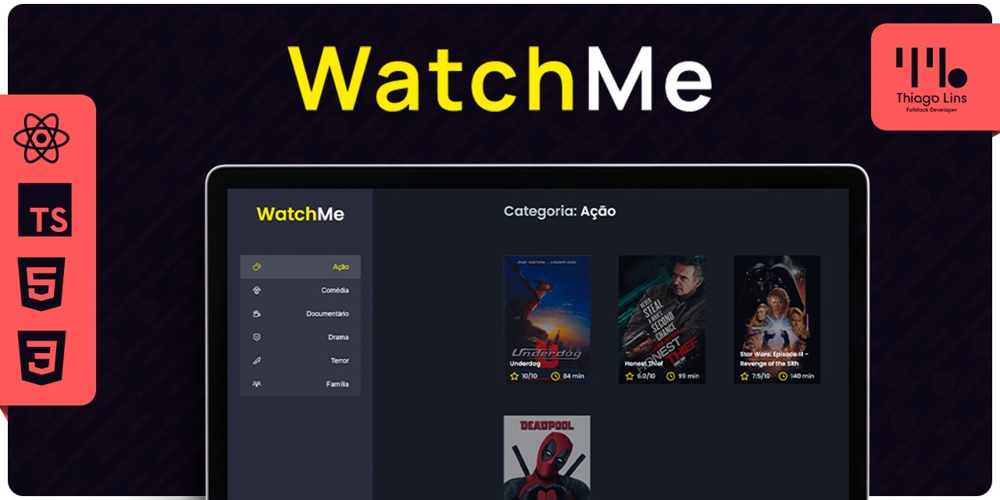

<div align="center" id="top">
  
[🇧🇷 Português](./README.md) | [🇺🇸 English](./README_EN.md) | [🇪🇸 Español](./README_ES.md)

</div>

# WatchMe: Componentizando la Aplicación

<div align="center">



[Ver Demo](https://td-watchme.vercel.app/)


</div>

## 📖 Índice

- [Acerca del Proyecto](#-acerca-del-proyecto)
- [Capturas de Pantalla](#-capturas-de-pantalla)
- [Instalación y Uso](#-instalación-y-uso)
- [Tecnologías](#-tecnologías)
- [Licencia](#-licencia)
- [Cómo Contribuir](#-cómo-contribuir)
- [Agradecimientos](#-agradecimientos)
- [Contacto](#-contacto)

## 📘 Acerca del Proyecto

El proyecto consiste en una aplicación de listado de películas que consume datos de una API falsa. El desafío consiste en componentizar la aplicación, ya que todo está en el archivo App.tsx. El objetivo es dividir la aplicación en dos componentes principales: SideBar y Content, reutilizando todo el código de App.tsx. Después de la componentización, debe comportarse de la misma manera que cuando no estaba dividida en componentes.

## 📷 Capturas de Pantalla

#### En Construcción 🔨🚧

## 🚀 Instalación y Uso

```bash
# Clona este repositorio:
git clone https://github.com/thiilins/WatchMe.git

# Navega al directorio del proyecto:
cd WatchMe

# Instala las dependencias:
yarn
# o
npm install

# Inicia la aplicación:
yarn dev
# o
npm run dev

# Accede a la aplicación en tu navegador en: `http://localhost:3000`
```

## 🛠 Tecnologías

- VSCode (IDE)
- ReactJS
- Axios
- HTML
- TypeScript
- SASS
- JavaScript
- JSON Server

## 📜 Licencia

Este proyecto está bajo la Licencia MIT. Consulta el archivo [LICENSE](./LICENSE) para obtener más detalles.

## 🤝 Cómo Contribuir

1. **Haz un Fork** de este repositorio.
2. Crea una nueva **rama** para tus cambios: `git checkout -b mi-función`.
3. Guarda tus cambios y crea un commit explicando lo que hiciste: `git commit -m "Agregando mi-función"`.
4. Envía tus cambios: `git push origin mi-función`.
5. Crea una **solicitud de extracción**.

## 🙌 Agradecimientos

Agradecemos a todos los colaboradores que han hecho posible este proyecto.
[Desafío 02 - WatchMe](https://www.notion.so/Desafio-02-Componentizando-a-aplica-o-b9f0f025c95b437699d0c3115f55b0f1) - Notion con toda la información.

## 📬 Contacto

Para sugerencias, comentarios o preguntas, abre un [issue](https://github.com/thiilins/WatchMe/issues) o contáctame a través de mi [perfil en GitHub](https://github.com/thiilins).

<p align="right">(<a href="#top">Volver arriba</a>)</p>
